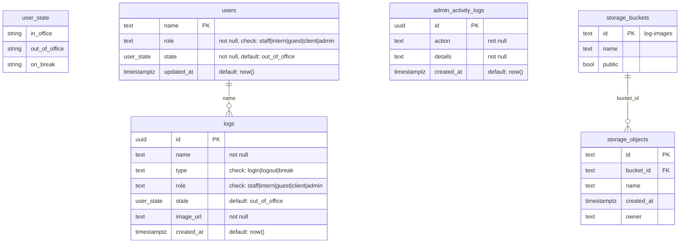
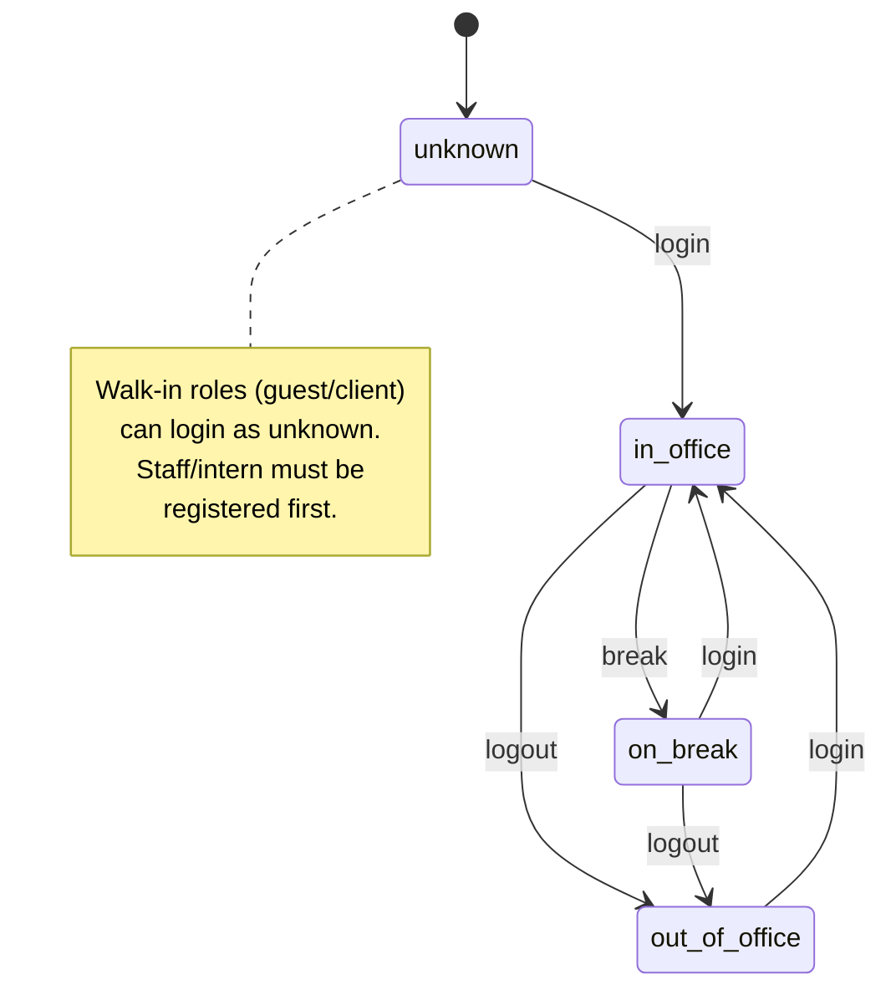
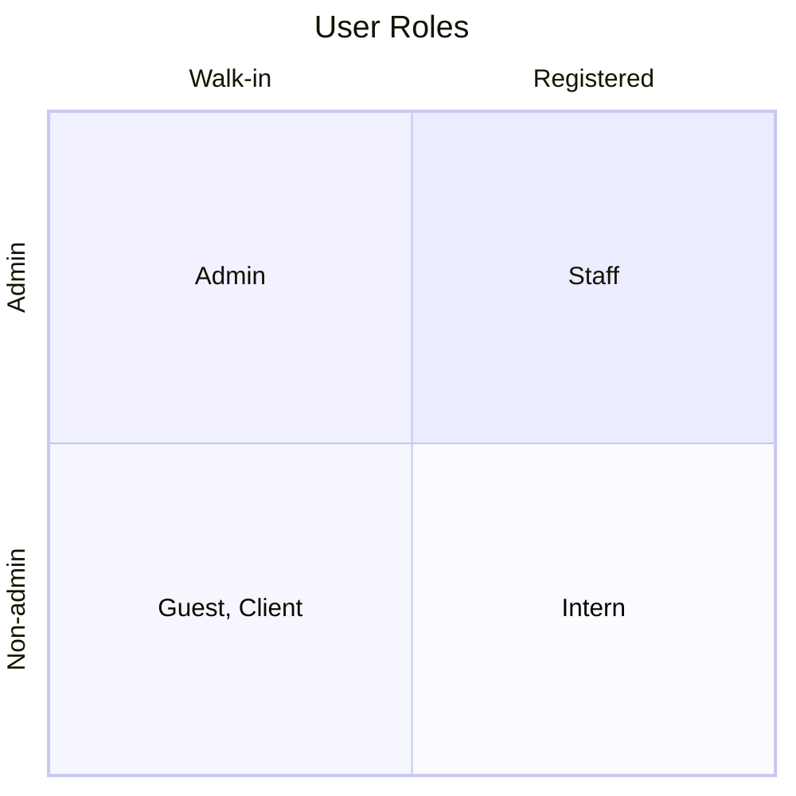
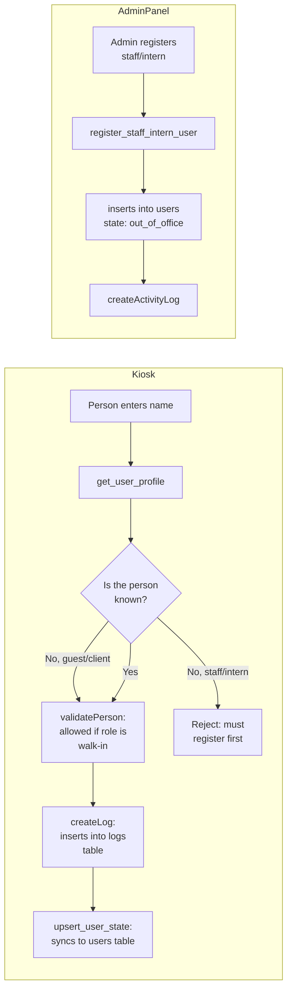
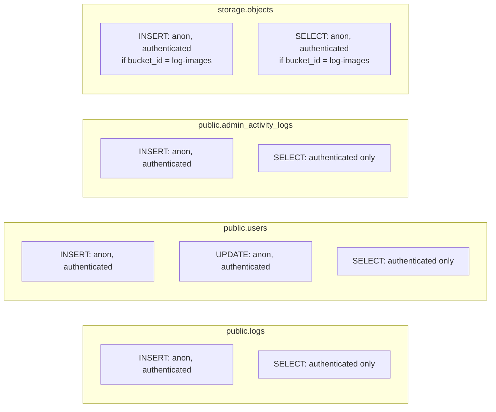

# Database Schema

## State Machine

## Roles

## Data Flow

## Access Control (RLS)

## RPC Functions

| Function | Returns | Purpose |
|---|---|---|
| `get_user_state(p_name)` | `user_state` | Read a user's current state from `users` table |
| `get_user_profile(p_name)` | `(name, role, state)` | Read role + state, falls back from `users` to `logs` |
| `get_user_suggestions()` | `(name, role)` | Autocomplete list, deduplicated from `users` + `logs` |
| `upsert_user_state(p_name, p_role, p_state)` | `void` | Upsert user's state on each log entry |
| `register_staff_intern_user(p_name, p_role)` | `(name, role, state, updated_at)` | Register a staff/intern with `out_of_office` state |
| `get_staff_intern_users()` | `(name, role, state, updated_at)` | List all staff/intern users |
| `delete_user(p_name)` | `void` | Remove a user from `users` table |
| `rename_user(p_old, p_new)` | `(name, role, state, updated_at)` | Change a user's name (PK) |
| `update_user_role(p_name, p_role)` | `(name, role, state, updated_at)` | Change a user's role |

## Key Rules

- **New users** are created with `state = 'out_of_office'`
- **Walk-in roles** (`guest`, `client`) can self-register by logging in at the kiosk
- **Staff/intern** must be pre-registered via admin panel before they can log in
- The `logs` table records every action; the `users` table stores the current state snapshot
- Photo uploads go to the `log-images` storage bucket
